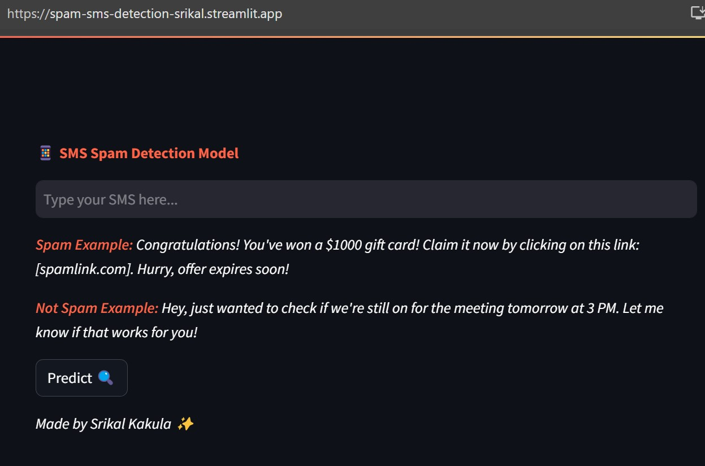

# SMS Spam Detection By Srikal Kakula under the guidance of Edunet Foundation.
## Overview
SMS Spam Detection is a machine learning model that takes an SMS as input and predicts whether the message is a spam or not spam message. The model is built using Python and deployed on the web using Streamlit.


### 


## Technology Used
- Python
- Scikit-learn
- Pandas
- NumPy
- Streamlit

### Dataset 
[here](https://www.kaggle.com/datasets/uciml/sms-spam-collection-dataset)


## Demo Project
[here](https://spam-sms-detection-srikal.streamlit.app/)

## Usage
To use the SMS Spam Detection model on your own machine, follow these steps:

+ Clone this repository.
+ Install the required Python packages using 
```
pip install -r requirements.txt.
```
+ Run the model using 
```
streamlit run app.py.
```
+ Visit localhost:8501 on your web browser to access the web app.

## Contributions
Contributions to this project are welcome. If you find any issues or have any suggestions for improvement, please open an issue or a pull request on this repository.


